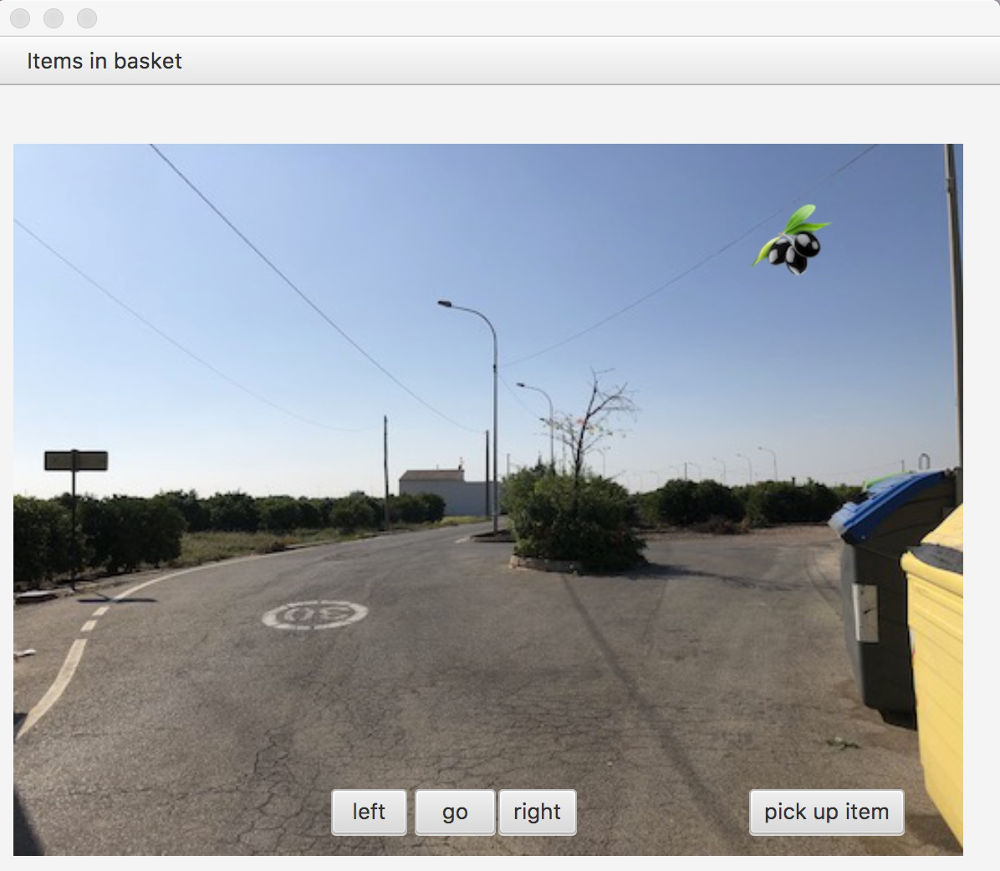

# game_mahuella

This is an application which allows the user to move around and manipulate objects in a “virtual world”. The view is made out of 2-D images as shown in the screen shot below, and the user can move from one location to another, look in different directions - similar to Google “Street View” and collect items in the provided locations.

This project is desiged in an object-oriented manner, it is utalizing graphical user interfaces, and large libraries of external code.

## install
In order to run the code the following tools have to be installed and configured.

### Java
JDK version 11 is necessary for running this code.

check java version with:

`$ java --version`

the expected output should be:

`java 11.0.3 2019-04-16 LTS`

`Java(TM) SE Runtime Environment 18.9 (build 11.0.3+12-LTS)`

`Java HotSpot(TM) 64-Bit Server VM 18.9 (build 11.0.3+12-LTS, mixed mode)`

### Gradle
Gradle is a “build tool” to orchestrate the construction between all of the components of the application dependencies.

Gradle version 5 has to be installed to run this code.

`$ gradle --version`
Gradle 5.4.1
Build time:
Revision:
Kotlin:
Groovy:
2019-04-26 08:14:42 UTC
261d171646b36a6a28d5a19a69676cd098a4c19d
1.3.21
2.5.4
Ant:          Apache Ant(TM) version 1.9.13 compiled on July 10 2018
JVM:          11.0.3 (Oracle Corporation 11.0.3+12-LTS)
OS:           Mac OS X 10.14.5 x86_64

### JavaFx 
JavaFx is a library for creating graphical interfaces.

JavaFx will be automatically downloaded by the Gradle build files, hence it is not necessary to do it manually.
